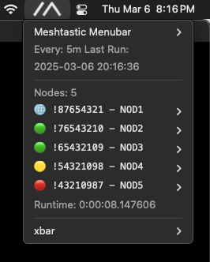
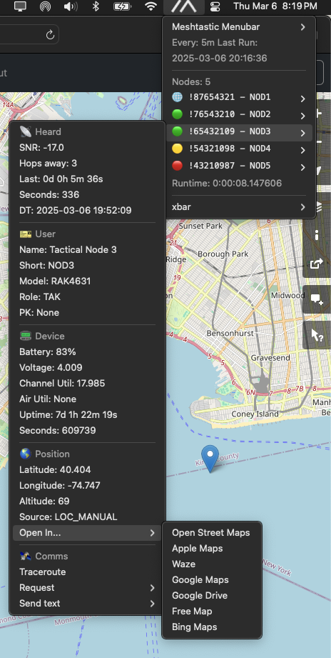

# meshtastic-menubar

Query your Meshtastic device and show discovered nodes in the menubar on macOS and linux.

# Usage

Lists nodes in order of last heard with most recent at top.

Format: `<lastHearrd> <device_id> - <short_name>`

Example: `🟢 !12345678 - NODE >`

- 🟢 Green nodes have been heard in past hour
- 🟡 Yellow nodes three hours
- 🟠 Orange 12 hours
- 🔴 Red past three days
- 🟣 Purple heard in past seven days
- 🔵 Blue nodes are ice cold, we haven't heard from them in over a week
- ⚫ Black nodes were partially received without timestamp

Clicking on a node will display submenu with device metadata:

- Heard data
- User data
- Device data
- Position data
- Comms menu

If these menus are missing then it means the device has not received this data from that node yet. Not every node sends all types.

# Install

Requires a meshtastic device already configured to work with meshtastic-cli before using this app.

## Automatic

- Run `make install` in terminal on macos.

## Manual

- Install uv
- uv will install python 3.12 on first run
- Install xbar
- Copy `meshtastic-menubar.5m.py` to `$HOME/Library/Application\ Support/xbar/plugins/`
- Edit `$HOME/.meshtastic-menubar.yml` to configure options
- Start xbar

# Configuration

Will read parameters from `$HOME/.meshtastic-menubar.yml` in yaml format. Config file defaults to wifi connection to http://meshtastic.local

- Choices for `bitbar` are `xbar`, `swiftbar`, or `argos`
- Choices for `connection` are `wifi`, `bluetooth`, or `serial`

See [config.yml](config.yml) for example config with more parameters.

# Notes

All testing was performed with Heltec v3 ESP based boards so far. Report any issues to https://github.com/elwarren/meshtastic-menubar/issues

The first [meshtastic-menubar](https://github.com/elwarren/meshtastic-menubar) just parsed the [Meshtastic CLI](https://meshtastic.org/docs/software/python/cli/) output and dumped it to the menu. That quickly ran into limitations that could only be overcome by directly interfacing with the device. Then came the icons, then metadata, then submenus, and finally we're here with config files and different interfaces. "It works on my machine" and I've attempted to make it easy to use. I've nearly pushed xbar to the limits and anything more deserves a native app.

## Connecting

All three connection methods were tested successfully but each have their own caveats. 

The wifi connection is the fastest and most reliable method.

The serial connection works but returns data in a different format than wifi. The meshtastic autodiscovery fails if there are two serial devices attached. The config file suggests a default path of `/dev/cu.usbserial-0001` but this will change depending on what type of USB cable is used. It's also different on Linux vs macOS. If you don't know what this means, it's usually the same serial device used to flash the firmware.

The bluetooth connection works but can timeout before connecting in a noisy environment.

## Sending Messages

Since xbar is not an interactive tool, the sendtxt and traceroute features are calls out to the [Meshtastic CLI](https://meshtastic.org/docs/software/python/cli/) to execute.

## Receiving Messages

This app will not show messages. Use the [Meshtastic Web Client](https://meshtastic.org/docs/software/web-client/) over wifi or install the [Meshtastic macOS App](https://meshtastic.org/docs/software/apple/installation/).

I like this app better, please add messages? Sorry, but this app cannot show past message history because the python api does not (currently) support downloading messages from the device. It cannot listen for incoming messages because this app is meant to be a lightweight stateless monitor. It wakes up every five minutes, grabs nodelist from the device, and goes back to sleep. Maintaining an active connection to the device would draw more power and reduce the device battery life.

# License

This project is licensed under the terms of the **GPL-3.0 license**.

